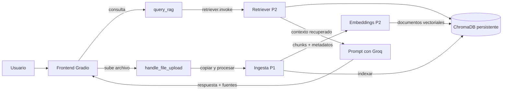
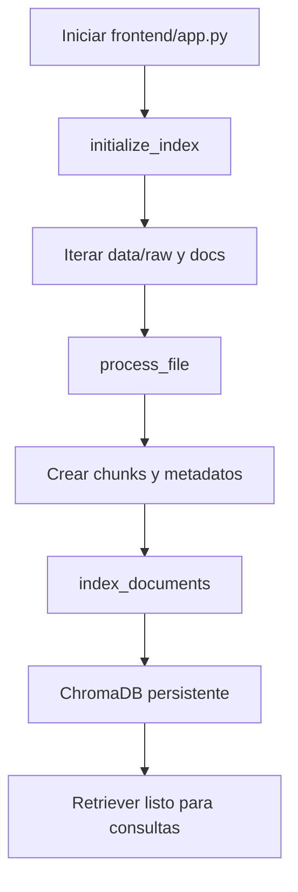
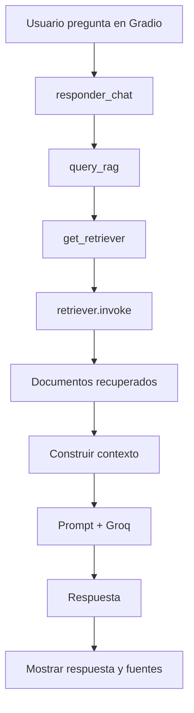
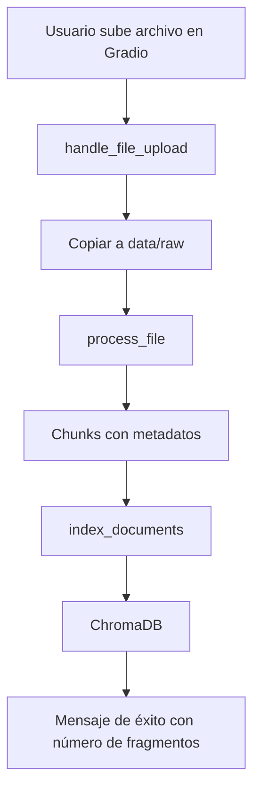

# Arquitectura de DevMind

## Propósito

DevMind es una aplicación de RAG para consultar documentación técnica, APIs e infraestructura. La interfaz permite:

1. Consultar documentación existente mediante lenguaje natural.
2. Subir archivos PDF, Markdown o TXT y procesarlos inmediatamente.
3. Ver la respuesta junto con los fragmentos recuperados y sus metadatos de trazabilidad.

## Stack

- **Interfaz:** Gradio
- **Orquestación RAG:** módulos Python de `src/backend`
- **Ingesta:** LangChain Documents, PDF, Markdown y TXT
- **Embeddings:** `sentence-transformers/paraphrase-multilingual-MiniLM-L12-v2`
- **Vector store:** ChromaDB persistente
- **Generación de respuestas:** Groq mediante el cliente oficial de LangChain/OpenAI-compatible API

> No se utiliza FastAPI. La capa de backend es una colección de funciones Python que orquesta el flujo, no un servidor HTTP.

## Flujo general



## Componentes y responsabilidades

### 1. Frontend: Gradio

El flujo principal está en `frontend/app.py`.

- La pestaña **Chat Técnico** envía la pregunta a `query_rag`.
- La pestaña **Gestión de Documentos** recoge un archivo y ejecuta `handle_file_upload`.
- El panel de trazabilidad muestra el archivo, el fragmento y la relevancia recuperada.
- No existe una API REST ni un endpoint FastAPI entre el frontend y el motor RAG.

### 2. Ingesta: P1

Módulos en `src/ingestion/`:

- `load_file(path)` carga PDF, Markdown o TXT y normaliza el texto.
- `split_documents(...)` divide el contenido en chunks y genera metadatos.
- `process_file(path)` ejecuta carga, limpieza, chunking y extracción de información.
- `process_directory(directory)` procesa archivos de una carpeta, incluyendo subcarpetas.

Los archivos soportados son `.pdf`, `.md` y `.txt`.

### 3. Embeddings: P2

`src/vectorstore/embeddings.py` configura la fábrica de embeddings mediante `get_embeddings()`.

- Modelo por defecto: `sentence-transformers/paraphrase-multilingual-MiniLM-L12-v2`
- Variable de configuración: `EMBEDDING_MODEL`
- Vectores normalizados: `normalize_embeddings=True`
- Instancia reutilizada con `lru_cache`, evitando crear el modelo en cada llamada

### 4. Vector store: P2

`src/vectorstore/store.py` administra ChromaDB.

- Ruta persistente: `data/processed/chroma`
- Colección: `devmind_docs`
- Variable de configuración: `CHROMA_PATH` y `COLLECTION_NAME`
- `index_documents(docs)` inserta o actualiza chunks.
- Los IDs estables se obtienen de `metadata["chunk_id"]`.
- Al reindexar el mismo archivo, se eliminan los chunks obsoletos de esa fuente.
- El vector store genera un score de relevancia en `[0, 1]` a partir de la distancia L2 de Chroma.

### 5. Retriever: P2

`src/vectorstore/retriever.py` crea el retriever con:

- `TOP_K`: valor por defecto `4`
- `SIMILARITY_THRESHOLD`: valor por defecto `0.30`
- Búsqueda: `similarity_score_threshold`
- Parámetros configurables mediante variables de entorno

El retriever devuelve únicamente documentos que superan el umbral configurado.

### 6. RAG y Groq: P3

`src/backend/rag_chain.py` coordina el flujo:

1. `initialize_index(...)` procesa los documentos de `data/raw` y `docs`.
2. `index_documents(...)` los persiste en ChromaDB.
3. `query_rag(...)` invoca el retriever con la pregunta del usuario.
4. El contexto recuperado se incorpora a un prompt de sistema.
5. Groq genera la respuesta con `LLM_MODEL`, por defecto `openai/gpt-oss-20b`.
6. La respuesta y los fragmentos recuperados se devuelven a Gradio.

La carga de un archivo utiliza `handle_file_upload(...)`, que copia el archivo a `data/raw`, procesa el contenido y lo indexa.

## Flujo de inicialización



## Flujo de consulta



## Flujo de subida



## Metadatos de trazabilidad

Cada chunk debe incluir al menos los siguientes campos:

```json
{
  "source": "guia_despliegue_cicd.md",
  "section": "Entornos de Staging",
  "repository": "backend-core",
  "tech_stack": "GitLab CI",
  "page": 1,
  "chunk_id": "guia_despliegue_cicd.md::p1::0::abcdef"
}
```

| Campo | Tipo | Obligatorio | Significado |
|---|---|---|---|
| `source` | string | Sí | Nombre del archivo de origen |
| `section` | string | Sí | Encabezado más cercano; `General` si no existe |
| `repository` | string | No | Repositorio inferido o `N/A` |
| `tech_stack` | string | No | Tecnología inferida o `N/A` |
| `page` | int | No | Número de página; PDF usa `1` por defecto |
| `chunk_id` | string | Sí | Identificador determinista para actualizar e identificar el chunk |

`chunk_id` es la clave estable de los fragmentos. La indexación evita duplicados y permite actualizar un archivo existente sin crear nuevos registros.

## Contratos de funciones

| Módulo | Función o flujo | Responsabilidad |
|---|---|---|
| `src/ingestion` | `process_file(path)` | Cargar, limpiar, dividir y metadataizar un archivo |
| `src/ingestion` | `process_directory(path)` | Procesar todos los archivos compatibles de una carpeta |
| `src/vectorstore/embeddings.py` | `get_embeddings()` | Crear y reutilizar el modelo de embeddings |
| `src/vectorstore/store.py` | `index_documents(docs)` | Persistir, actualizar y eliminar chunks obsoletos |
| `src/vectorstore/retriever.py` | `get_retriever(k)` | Crear el retriever semántico con umbral |
| `src/backend/rag_chain.py` | `initialize_index(...)` | Indexar el corpus inicial |
| `src/backend/rag_chain.py` | `query_rag(...)` | Recuperar contexto y consultar Groq |
| `src/backend/rag_chain.py` | `handle_file_upload(...)` | Guardar y procesar archivos subidos |
| `frontend/app.py` | `responder_chat(...)` | Mostrar respuesta y fuentes en Gradio |

## Configuración

- `EMBEDDING_MODEL`: modelo de embeddings
- `CHROMA_PATH`: directorio persistente de ChromaDB
- `COLLECTION_NAME`: colección de ChromaDB
- `TOP_K`: número máximo de fragmentos recuperados
- `SIMILARITY_THRESHOLD`: umbral de similitud
- `LLM_MODEL`: modelo de Groq
- `GROQ_API_KEY` o `LLM_API_KEY`: clave de la API

Los artefactos generados, como `.venv` y `data/processed/chroma`, no deben versionarse.

## Consideraciones

- El sistema no depende de FastAPI ni de endpoints HTTP.
- La interfaz de usuario es Gradio y se comunica directamente con las funciones Python.
- ChromaDB conserva el índice entre ejecuciones.
- La ingesta y el indexamiento usan metadatos de archivo y sección para mantener trazabilidad.
- Los resultados de recuperación se muestran al usuario antes de responder, permitiendo verificar las fuentes.
