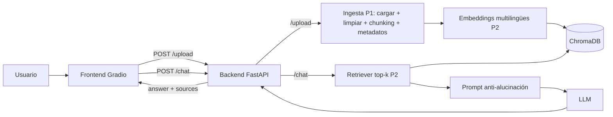

# Arquitectura y contratos de interfaz

## Stack
LangChain · Embeddings multilingües · ChromaDB · FastAPI · Gradio

## Funcionalidad
Sistema RAG corporativo para desarrolladores y DevOps. Desde el frontend el usuario puede:
1. **Cargar documentos** (.pdf, .md, .txt) que se procesan e indexan.
2. **Hacer preguntas** en un chat en lenguaje natural.
3. **Ver la respuesta junto con las fuentes citadas** (documento, sección y texto original).

## Flujo general


## Schema de metadatos (trazabilidad)
Todo chunk indexado debe incluir estos campos:
```json
{
  "source": "guia_despliegue_cicd.md",
  "section": "Entornos de Staging",
  "repository": "backend-core",
  "tech_stack": "GitLab CI",
  "page": 1
}
```
| Campo | Tipo | Obligatorio | Nota |
|---|---|---|---|
| source | string | sí | nombre del archivo |
| section | string | sí | encabezado más cercano; `"General"` si no hay |
| repository | string | no | repositorio al que aplica |
| tech_stack | string | no | tecnología principal |
| page | int | no | solo PDFs; `1` por defecto |

## Contrato API

### `POST /chat`
**Request**
```json
{ "question": "¿Cómo se despliega el servicio en staging?" }
```
**Response 200**
```json
{
  "answer": "Para desplegar en staging debe ejecutar el pipeline...",
  "sources": [
    {
      "text": "Ejecutar git push origin develop...",
      "metadata": { "source": "guia_despliegue_cicd.md", "section": "Entornos de Staging" }
    }
  ]
}
```
**Sin contexto suficiente**: `answer` con el mensaje por defecto (p. ej. "No encontré información sobre esto en la documentación disponible") y `sources: []`.

### `POST /upload`  _(añadido: laguna del enunciado)_
El enunciado exige que el frontend permita subir documentos, pero solo define `/chat`. Se añade este endpoint.

- **Content-Type:** `multipart/form-data`
- **Campo:** `files` (uno o varios archivos; extensiones permitidas: `.pdf`, `.md`, `.txt`)

**Response 200**
```json
{
  "status": "ok",
  "files": [
    { "filename": "guia_despliegue_cicd.md", "chunks_indexed": 12 }
  ],
  "total_chunks": 12
}
```
**Errores:** `400` extensión no permitida o archivo vacío · `413` archivo demasiado grande · `500` fallo al procesar/indexar (`{ "detail": "..." }`).

**Qué hace el backend:** guarda el archivo en `UPLOAD_DIR` → llama a la ingesta de P1 → indexa con la función de P2 → devuelve el resumen.

### `GET /health`
Devuelve `{ "status": "ok" }`. Lo usa el frontend para comprobar que el backend está disponible.

### Errores generales
`422` request inválido · `500` error interno con `{ "detail": "..." }`.

## Interfaces entre módulos (funciones acordadas)
| Módulo | Función | Ubicación |
|---|---|---|
| P1 Ingesta | `process_file(path: str) -> list[Document]` (carga + limpieza + chunking + metadatos) | `src/ingestion/` |
| P2 Vector store | `index_documents(docs: list[Document]) -> int` (devuelve nº de chunks indexados) | `src/vectorstore/store.py` |
| P2 Vector store | `get_retriever(k: int) -> BaseRetriever` | `src/vectorstore/retriever.py` |
| P3 Backend | `POST /chat`, `POST /upload`, `GET /health` | `src/backend/main.py` |
| P4 Frontend | consume la API por HTTP (`BACKEND_URL`) | `frontend/app.py` |

`scripts/ingest.py` (ingesta por lotes de `data/raw`) reutiliza `process_file` e `index_documents`.

## Reparto del endpoint `/upload`
- **P3** expone el endpoint y orquesta: guarda el archivo y llama a P1 y P2.
- **P1** entrega `process_file(...)`.
- **P2** entrega `index_documents(...)`.
- **P4** conecta el componente de subida de archivos de Gradio a `POST /upload`.

## Decisiones técnicas
_Completar conforme el equipo decida: modelo de embeddings multilingüe concreto, LLM, umbral de similitud, valor de k._
